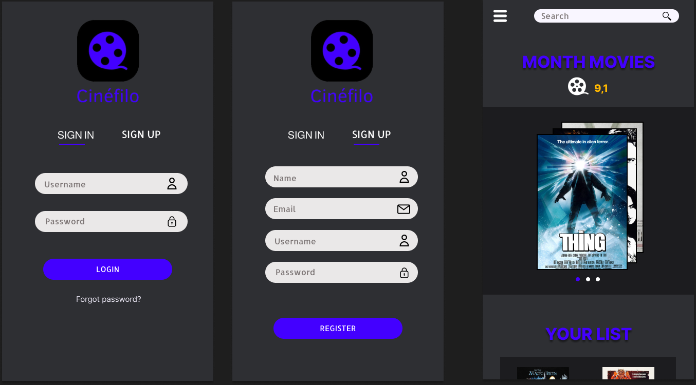

<!DOCTYPE html>
<html>
<body>
    <h1>Cinéfilo</h1>
    
O Cinéfilo é um aplicativo destinado a entusiastas de filmes que desejam manter um registro personalizado e detalhado de suas experiências cinematográficas. Este aplicativo foi projetado para que você possa facilmente catalogar e acessar informações sobre filmes que assistiu, suas notas e detalhes essenciais.

  <h2>Recursos Principais:</h2>
  <ul>
      <li>Registro de Filmes: Mantenha um registro organizado de todos os filmes que você assistiu.</li>
      <li>Notas e Avaliações: Adicione notas pessoais e avaliações aos filmes para registrar suas opiniões e sentimentos.</li>
      <li>Detalhes de Filmes: Acesse informações detalhadas sobre cada filme, incluindo elenco, diretor, gênero, data de lançamento e sinopse.</li>
      <li>Pesquisa Eficiente: Procure filmes rapidamente por título, diretor ou gênero para encontrar informações específicas.</li>
      <li>Listas Personalizadas: Crie listas personalizadas, como "Favoritos" ou "Assistir Mais Tarde", para organizar sua coleção de filmes.</li>
  </ul>

  
O Cinéfilo é a ferramenta perfeita para cinéfilos que desejam manter um registro detalhado de sua jornada cinematográfica. Explore, avalie e organize seus filmes favoritos de maneira eficiente e pessoal.

  
  <h3> Protótipo </h3>
  

  <h4> Equipe </h4>
  
 Vitor Hugo Oliveira Paloco - Pedro Henrique Ramoni Ouro 

</body>
</html>

